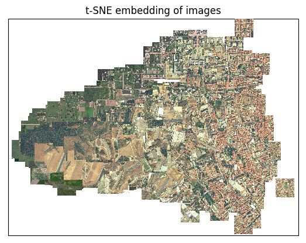

#### Questions for WG 2

1.	How to improve the quality/quantity of training data? (How do we quantify tradeoff?)

2.	What should be the metric for measuring training and testing data diversity? (How do decide splits?)

3.	How to achieve higher accuracies within each class, and between different classes?

4.	(How do we balance local, national, regional, global performance for global LCLU?)

5.	(How do you choose loss functions that relate class similarities to wrongness?)

#### Questions for WG 3 

1.	How do you maintain datasets across time and space for change tracking #WG3?

2.	How do we track data provenance over the course of training (data, labels) #WG3?

#### Definitions
- Stat vs. ML
- Traditional methods (feature engineering) vs. DL (none)
- White box vs. black box

***1. How to improve the quality/quantity of training data? (How do we quantify tradeoff?)***
- minimum standard information
  - metadata/provenance
  - contributor
  - method - image, ground
  - date of sample, labeling
  - location (bounding box)
  - Assumption that training data is derived from someone interpreting satellite image, which could be different from on-the-ground.
  - spatial scale
  - temporal scale
  - quality/confidence (of worker)
- quantity questions
  - which existing sources can be brought in? (photoquest, geowiki, AfSIS, OSM, ...)
  - filtered to comply with quality criteria
  - communicate standards to improve quality

***Framework for ML***
- Situation on the ground - want to do something, based on analysis.
- Ground truth as source data: Landsat/Sentinel.
- Source data error: out of date, cloudy, not representative of ground truth.
- Model: source data --> prediction.
- Believe model bc representative of source data. Test data MUST be representative of source data.
- Model error: run model on sample believed to be true, some bound of model error based on labels.
- Information error: source data doesn't align with problem, resolution of data or problem specification.
- Machine learning model: training data (should be related to source data) interacts with validation data (should look a lot like test data).
- Ground to action chain as accurate as possible.

***2. What should be the metric for measuring training and testing data diversity? (How do decide splits?)***
- class dependent representiveness
  - geographical/regional (intraclass variety)
  - spatially/temporally scaled, by class 
  - starting point: assess against existing LC maps
  - https://developmentseed.org/blog/2018/03/19/geo-diversity/

***Other***
- The ratio between smallest/largest, train/test number of class is constrained
- Transfer learning using use-case-specific-data, from local crowdworkers trained with the taxonomy and representative data for each class, in a structured way to maintain quality, which is maintained.

#### Best practices for modeling of LCLU
- mosaic of more than one image for more stability of NDVI
- expand feature space
  - temporal bands (MapBiomass)
  - spectral features including indices (NVDI, NDWI, NDFI)
  - spectral mixture analysis fractions
  - ancillary information (topography, band mean, max, min...)
- separate model for (super)classes/region? separate feature space for each class?
  - or nested classifications, acc to hierarchy
  - merging back with rules, with priority/probability
  - dichotomous - could be combination of criteria, where model/class doesn't exclude one land form over another
  - question: agri/not global, and specific classes regional?
  - map model & covariance, just another input layer that you're predicting
  - larger training set for the whole model, rather than splitting up
- iteration and adjustment of methods (to address problem areas, guide new traininig sample collectionn)
- appropriate class balance/weight (rule of thumb might emerge, over/undersamlple under/over represented)
- DL - different spatial strategy (large enough window size, like 512 px)
- combination rules
  - adjacency
  - class combine on the same map --> lowest commision error
- accuracy reporting standard/commission/ommission (Olaffson)
  - ***Like ICCC climate models, described for development field, more categorical like high/medium/low***
    - could be done through likelihoods, relative likelihoods
    - producer/user error/confusion error
- caveats
- map model metadata
- ensembling is common practice in climate models/species distribution models
  - mean prediction is more accurate than single prediction of any model
  - appropriate merging procedure/Bayaesian merging
  - competitions won
  - if models very complimentary (specific, sensitive), better model, often
  - FAO LC map already map/class, merge
  - ^superlearners
  - might be computationally expensive for little benefit
- stable samples (MapBiomass), over multiple years
- training label cotemporaneous with image being collected
  - important to have date of label

***How to increase accuracy of training labels?***
- completeness/represnetitiveness of training samples may be harder to ensure than accuracy
- consensus approach  --> ordinal ranking (Agreement-based methods & Embedded gold standard)
  - individual worker accuracy or expert (like OSM)
- training for crowdsourcers (for all classes they will label, for variability of class) - simple instructions
- validated accuracy (qualification test), acc to skill ratings, weighted merging back into consensus)
- task for representativeness: where data needs to be collected
  - hidden layer of error in LC map
- how to incorporate training data error (error inherent in our labels) into final map accuracy
- connect work to people in region/know region
- validation: expert or ground (target to areas hardest to distinguish in imagery)
  - abandoned agriculture or in rotation
- (if payment, consider the ethics of hourly wage)

***How to achieve higher accuracies within each class, and between different classes? (subset of best practices for modeling)***
- samples across the class variability
  - temporal, spatial scales
- iteration over, to improve accuracy

***How to maintain training datasets?***
- institutional support for training data collection
- keep updating, for yearly update
- versioning, like MODIS collection (v1, keep improving through future versions)
- yearly (back to 2015 bc Sentinel-2)
- document versions with key details
- OSM as a home? existing work, refine protocols to aim at collecting training samples
  - direct OSM for specific sites for v1
  - improve certain classes in future versions
- dedicated sample sites

#### Data sharing

